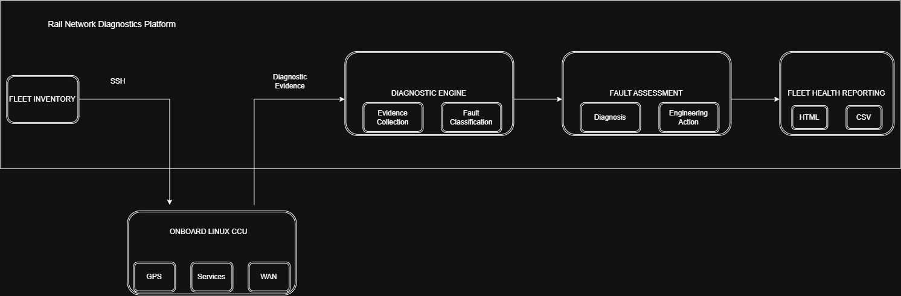

# Rail Network Diagnostics

**Python · Linux · SSH · Network Automation · GPS · Cellular WAN · Automated Fault Classification**

A Python-based network diagnostics platform developed to automate remote fault investigation across operational rail fleets.

The platform securely connects to onboard Linux-based communication systems, collects GPS, network, service and cellular modem health data, and converts raw system state into **fault classifications, engineering recommendations and fleet-wide health reports**.

The project was created from real-world engineering requirements: reducing repetitive manual investigation, improving first-line diagnosis and identifying faults remotely before engineering intervention or depot attendance is required.

### Current Capabilities

* Multi-fleet GPS and WAN diagnostics
* Dynamic GPS hardware discovery
* Automated GPS and WAN fault classification
* Fleet-aware hardware and network topology validation
* Engineering action recommendations based on detected fault signatures
* Fleet-wide CSV and HTML health reporting

---

## Architecture & Diagnostic Workflow

The platform uses an inventory-driven workflow to connect to onboard systems, collect diagnostic evidence and convert it into actionable engineering information.



---

## Key Capabilities

### GPS Diagnostics

The platform remotely validates the health of the onboard GPS subsystem, including:

* GPS process status
* MQTT service status
* GPS broadcast process status
* Network/VLAN interface presence
* GPS receiver output
* NMEA sentence availability
* GPS fix status
* Satellite visibility
* UTC timestamp validity
* Active GPS device discovery

Collected evidence is assessed by the diagnostic engine to distinguish between healthy operation, service-level warnings, network issues and GPS receiver/fix faults.

### WAN & Modem Diagnostics

WAN diagnostics collect and analyse modem and network state from onboard communication systems.

Current checks include:

* Modem hardware discovery
* Sierra Wireless and Huawei modem detection
* Modem firmware collection
* Serving cell identification
* WAN interface detection
* WAN availability
* WAN latency (RTT)
* Cellular technology and band
* Network registration state
* Attach state
* DHCP/interface state
* Carrier Aggregation status
* Automated WAN fault classification

Rather than reporting raw modem values alone, the platform correlates observed state to produce a likely diagnosis and recommended engineering action.

### Fleet Automation & Reporting

Inventory-driven scanning allows diagnostics to be performed across multiple trains without manually connecting to each system individually.

The platform can:

* Read fleet inventory definitions
* Connect remotely to multiple onboard systems
* Automatically apply fleet-specific hardware profiles
* Run GPS and WAN diagnostics
* Identify offline or unreachable units
* Classify detected faults
* Record supporting diagnostic evidence
* Generate fleet-wide CSV reports
* Generate HTML fleet health reports

This provides engineers with a consistent view of fleet health while retaining the evidence required for deeper investigation.

---

## Engineering Challenges & Solutions

### Dynamic GPS Device Discovery

One of the early assumptions in the project was that GPS receivers could be accessed using fixed Linux serial-device paths.

Testing across 4600CCU platforms showed that USB serial devices are **dynamically assigned during system boot**, meaning a GPS receiver could move between device paths after a reboot.

For example:

```text
/dev/ttyUSB3
/dev/ttyUSB6
/dev/ttyUSB7
/dev/ttyUSB9
```

Hardcoding a serial device therefore created unreliable diagnostics.

The platform was redesigned to discover the active GPS receiver dynamically by:

1. Locating the running GPS process.
2. Inspecting its open file descriptors to identify the serial device in use.
3. Falling back to scanning available USB serial devices when required.
4. Validating candidate devices by detecting genuine NMEA data streams.

This allows the same diagnostic logic to continue operating when Linux device enumeration changes between boots.

### Evidence-Based WAN Fault Classification

The WAN functionality initially focused on collecting basic modem and interface status.

Further investigation of the onboard Linux environment identified detailed modem runtime information exposed through the unified communications subsystem.

By analysing combinations of:

* modem detection
* network registration
* attach state
* interface creation
* DHCP state
* cellular technology
* carrier aggregation
* WAN latency
* observed runtime state

the platform evolved from simple status collection into an **evidence-based fault classification engine**.

This allows conditions such as registration failure, DHCP failure, session establishment problems and abnormal WAN latency to be distinguished from one another and paired with appropriate engineering actions.

### Mixed-Fleet Hardware & Topology Support

The supported rail fleets do not share identical hardware or network configurations.

Differences include:

* CCU hardware generation
* GPS device behaviour
* modem types
* number of active WAN interfaces
* expected WAN topology

A single fixed diagnostic profile would therefore generate false failures.

Fleet-aware profiles were introduced so that the diagnostic engine understands which hardware and interfaces are expected for each platform.

This allows one diagnostic platform to assess multiple fleets while accounting for legitimate differences in system architecture.

---

## Example Diagnostic Output

```text
GPS Diagnostic Report - TRAIN001

SERVICE CHECKS
----------------------------------------
GPS Device Present   : True
GPS Device Used      : /dev/ttyUSB3
GPS Process Running  : True
MQTT Running         : True
Broadcast Running    : False
VLAN105 Present      : True

GPS STATUS
----------------------------------------
GPRMC Status         : A
UTC Time             : 061522.000
Satellites Visible   : 20

ASSESSMENT
----------------------------------------
Diagnosis            : GPS operational with service warning
Likely Cause         : GPS receiver has a valid fix, but the GPS broadcast process is not running.
```

The objective is not simply to expose raw system data, but to provide an engineer with enough context to understand **what has failed, the evidence supporting that diagnosis and the appropriate next action**.

---

## Fault Classification Engine

The diagnostic engine evaluates collected system state against known and observed fault signatures.

### GPS Fault Classifications

Current classifications include:

* GPS Operational
* GPS Operational with Service Warning
* GPS Operational with Network Warning
* GPS Device Not Detected
* GPS Process Not Running
* GPS Receiver Not Outputting NMEA
* GPS Invalid Fix - No Satellites Visible
* GPS Invalid Fix Despite Satellite Visibility
* GPS Invalid Fix
* GPS Broadcast Process Not Running
* MQTT Process Not Running
* GPS VLAN105 Interface Missing

### WAN Fault Classifications

Current classifications include:

* WAN Operational
* WAN Disabled by Fleet Design
* Modem Not Detected
* Network Registration Failure (NO PLMN)
* WAN Attach / Interface Bring-Up Failure
* DHCP Negotiation Failure (`dhcp_cal`)
* DHCP Lease Acquisition Failure (No Lease)
* LTE Session Establishment Failure
* High Latency WAN Failure (60000ms RTT)
* WAN Session Recovery Failure
* Offline / Connection Timeout

Each diagnosis can include recommended engineering actions and escalation guidance based on the observed system state.

The fault library continues to evolve as diagnostic behaviour is compared against verified engineering outcomes.

---

## Supported Platforms

### Fleet & Hardware Profiles

| Fleet       | Hardware Platform | GPS Device Method           |
| ----------- | ----------------- | --------------------------- |
| GWR 165/166 | R3200CCU          | Fixed device (`/dev/ttyS1`) |
| GWR 800/802 | 4600CCU           | Automatic device discovery  |
| XC 170      | 4600CCU           | Automatic device discovery  |
| XC 220/221  | 4600CCU           | Automatic device discovery  |

### WAN Topologies

| Fleet       | Expected Active WANs |
| ----------- | -------------------- |
| GWR 165/166 | WAN1, WAN3           |
| GWR 800/802 | WAN1, WAN2           |
| XC 170      | WAN1, WAN2, WAN3     |
| XC 220/221  | WAN1, WAN2, WAN3     |

### Modem Support

Current diagnostic logic supports hardware including:

**Sierra Wireless**

* MC7455
* 7710
* 8801

**Huawei**

* Huawei mobile modems

---

## Project Evolution

The platform has developed iteratively in response to real diagnostic requirements and findings from operational systems.

### Phase 1 — GPS Diagnostics

Developed remote GPS health checking, service validation and initial fault assessment.

### Phase 2 — Multi-Fleet & Dynamic Hardware Support

Extended diagnostics across differing CCU platforms and introduced automatic GPS device discovery after identifying dynamic Linux USB enumeration.

### Phase 3 — Fleet Automation

Introduced inventory-driven scanning, automated remote diagnostics, offline-unit detection and fleet-wide CSV reporting.

### Phase 4 — WAN & Modem Diagnostics

Expanded the platform beyond GPS to collect modem, cellular network, interface and WAN health information.

### Phase 5 — Fault Classification

Developed evidence-based GPS and WAN fault signatures with automated diagnoses and recommended engineering actions.

### Phase 6 — Fleet Health Reporting

Introduced mixed-fleet WAN topology awareness, hardware-specific profiles and HTML fleet health reporting.

### Current Direction — Diagnostic Platform Evolution

Current development is focused on extending the platform toward historical analytics, scheduled diagnostics, wider network health assessment and increasingly automated fault response.

---

## Project Structure

```text
rail-network-diagnostics
│
├── docs/
│   ├── diagrams/
│   │   └── rail-diagnostics-architecture.drawio
│   ├── images/
│   │   └── rail-diagnostics-architecture.png
│   ├── FAULT_LIBRARY.md
│   └── project_notes.md
│
├── inventory/
│   └── example_inventory.csv
│
├── reports/
│
├── sample_data/
│   ├── healthy_gprmc.txt
│   ├── healthy_nmea.txt
│   ├── faulty_gprmc.txt
│   └── faulty_nmea.txt
│
├── gps_diag.py
├── ssh_test.py
├── requirements.txt
├── README.md
└── .gitignore
```

---

## Technologies

* **Python** — diagnostic logic, automation and reporting
* **Paramiko / SSH** — secure remote system interrogation
* **Linux** — process, device, interface and service diagnostics
* **TCP/IP & VLANs** — onboard network health assessment
* **Cellular WAN** — modem, registration, attach and session diagnostics
* **NMEA** — GPS receiver and fix-state analysis
* **CSV / HTML** — fleet health reporting and evidence collection
* **Git / GitHub** — source control and project management

---

## Repository Security & Data Handling

This public repository is designed to demonstrate the diagnostic platform without exposing operational fleet data or credentials.

* Operational inventory files are excluded from version control.
* A sanitised `example_inventory.csv` demonstrates the expected inventory structure.
* SSH keys and environment files are excluded through `.gitignore`.
* Generated diagnostic reports are excluded from source control.
* Example and sample diagnostic data is used where appropriate for public documentation.

Operational credentials, private addressing information and fleet-specific inventory data are not required to understand or review the project.

---

## Future Development

### Diagnostics

* Access point health diagnostics
* Network switch diagnostics
* CCTV service monitoring
* Additional end-to-end network health checks

### Automation & Analytics

* Historical GPS and WAN fault trending
* Scheduled fleet health scans
* Automated remediation workflows
* Reporting notifications
* Ticketing integration

### Platform

* Database-backed diagnostic history
* Interactive web dashboard
* Cloud-hosted deployment
* Fleet health analytics

The longer-term objective is to evolve the project from a remote diagnostic tool into a broader **network health, fault analysis and automated recovery platform**.

---

## Author

**Kevin Roper**

Infrastructure Engineer | AWS Certified | Cloud & Automation

[GitHub Profile](https://github.com/K-Roper-Projects)
